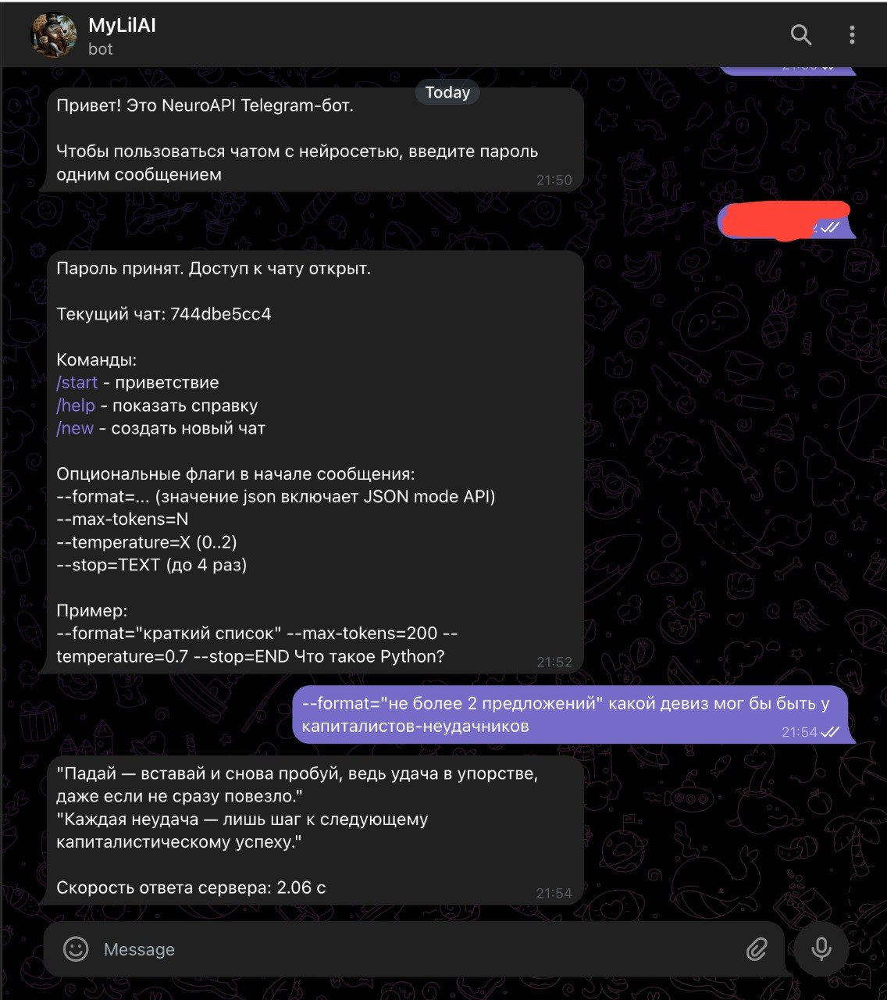

# AI Challenge (Python)

Единый репозиторий для многонедельного обучения по AI.

## Day 1 
Напишите минимальный код, который:

👉 отправляет запрос в LLM через API

👉 получает ответ

👉 выводит его в консоль или простой 
интерфейс (CLI / Web)

### Res

## Day 2
Отправьте один и тот же запрос, но:

👉 добавьте явное описание формата ответа

👉 добавьте ограничение на длину ответа

👉 добавьте условие завершения ответа (stop sequence или явную инструкцию)

### Res

## День 3. Разные способы рассуждения

Возьмите одну задачу
(логическую, алгоритмическую или аналитическую)

Решите её через API четырьмя способами:

👉 получите прямой ответ без дополнительных инструкций — [Результат](DAY_3_1.md)

👉 добавьте в промпт инструкцию: «решай пошагово» — [Результат](DAY_3_2.md)

👉 попросите модель сначала составить промпт для решения задачи, 
а затем используйте его  — [Результат](DAY_3_3.md)

👉 создайте в промпте группу экспертов
(например: аналитик, инженер, критик)
и получите решение от каждого   — [Результат](DAY_3_4.md)

## День 4. Температура

Выполните один и тот же запрос с параметрами:
👉 temperature = 0
👉 temperature = 0.7
👉 temperature = 1.2
[Результат](DAY_4.md)
При температуре 2.0 ИИ начинает выдавать несусветную дичь 

🔥День 5. Версии моделей

Выполните один и тот же запрос:
👉 на слабой модели
👉 на средней модели
👉 на сильной модели

[Результат](DAY_5.md)
Выполнил запрос на 3 моделях - GPT-5.4, gemini-2.5-flash, gpt-4.1-nano. 

| Модель | Цена | Токены (вход → выход) | Скорость ответа сервера |
| --- | --- | --- | --- |
| GPT-5.4 | 0,45 ₽ | 51 → 471 | 10.34 c |
| gemini-2.5-flash | 0,56 ₽ | 41 → 2927 | 14.80 c |
| gpt-4.1-nano | 0,01 ₽ | 47 → 434 | 3.30 c |

Самый качественный оответ, довольно подробно расписал, много текста -  gemini-2.5-flash
Самый оптимальный кмк по качетсву текста, объему - GPT-5.4
Самый дешевый, простой, но при этом все со смыслом, хоть и посоветовал бтс - gpt-4.1-nano.

## День 6. Первый агент

Реализовал помимо CLI интерфейса, еще и точку входа (`telegram_bot.py`) в виде телеграм бота @mylilaibot. 

### Результат
