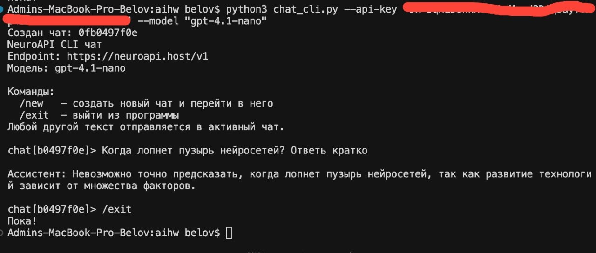
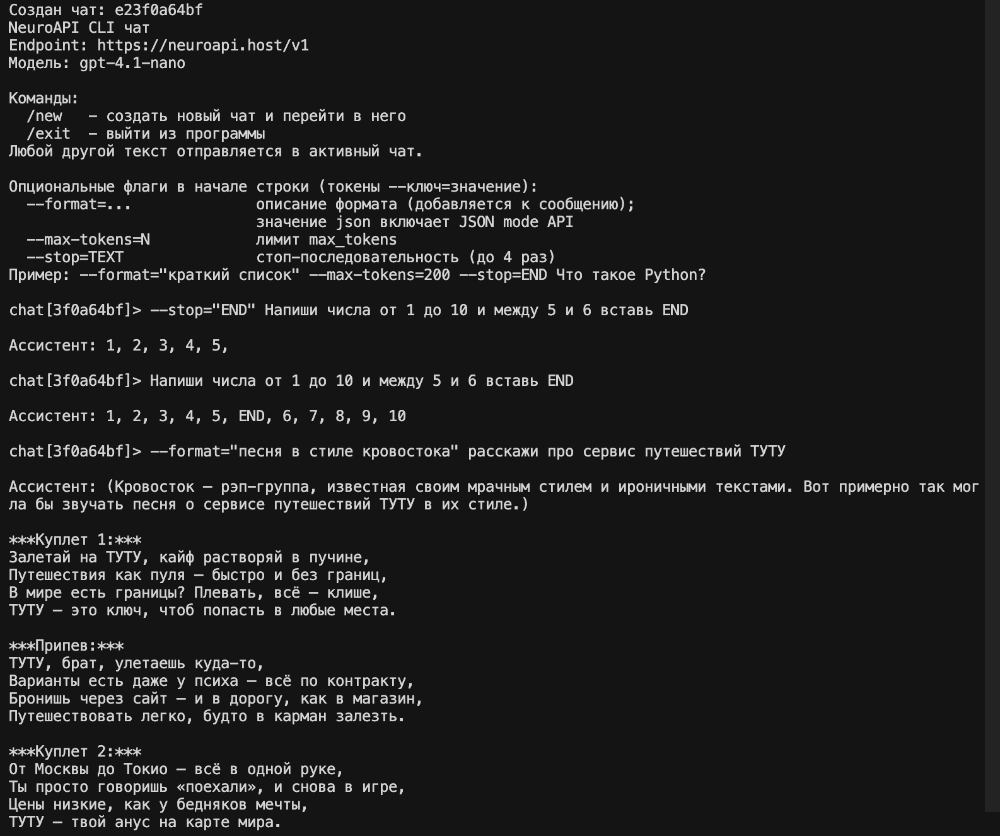
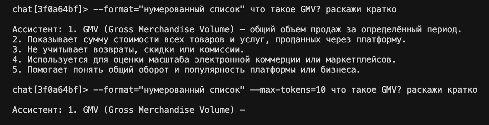

# AI Challenge (Python)

Единый репозиторий для многонедельного обучения по AI.

## Day 1 
Напишите минимальный код, который:

👉 отправляет запрос в LLM через API

👉 получает ответ

👉 выводит его в консоль или простой 
интерфейс (CLI / Web)

### Res

## Day 2
Отправьте один и тот же запрос, но:

👉 добавьте явное описание формата ответа

👉 добавьте ограничение на длину ответа

👉 добавьте условие завершения ответа (stop sequence или явную инструкцию)

### Res

## День 3. Разные способы рассуждения

Возьмите одну задачу
(логическую, алгоритмическую или аналитическую)

Решите её через API четырьмя способами:

👉 получите прямой ответ без дополнительных инструкций — [Результат](DAY_3_1.md)

👉 добавьте в промпт инструкцию: «решай пошагово» — [Результат](DAY_3_2.md)

👉 попросите модель сначала составить промпт для решения задачи, 
а затем используйте его  — [Результат](DAY_3_3.md)

👉 создайте в промпте группу экспертов
(например: аналитик, инженер, критик)
и получите решение от каждого   — [Результат](DAY_3_4.md)